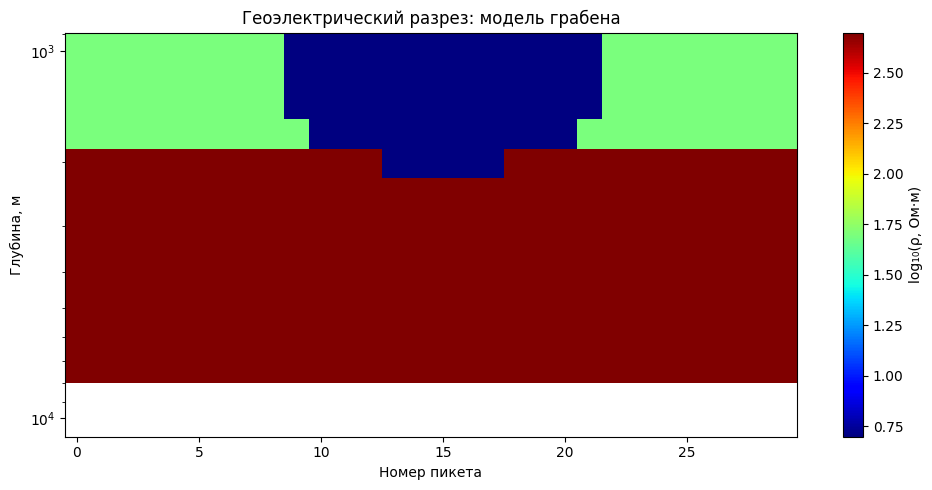
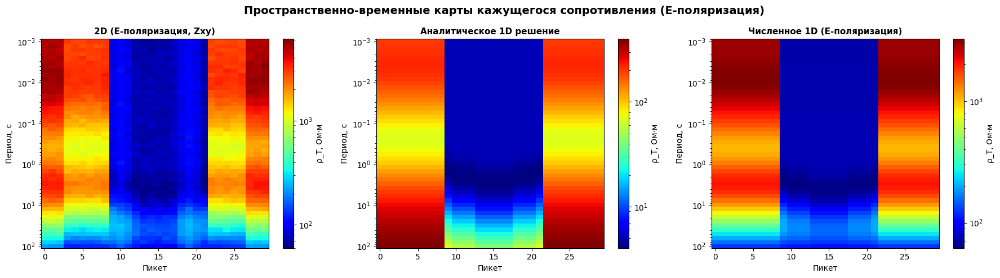
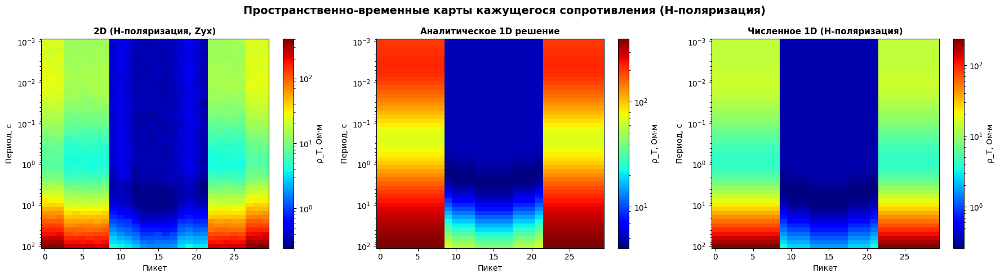
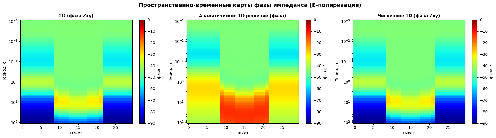
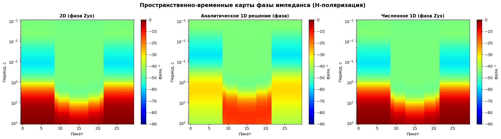
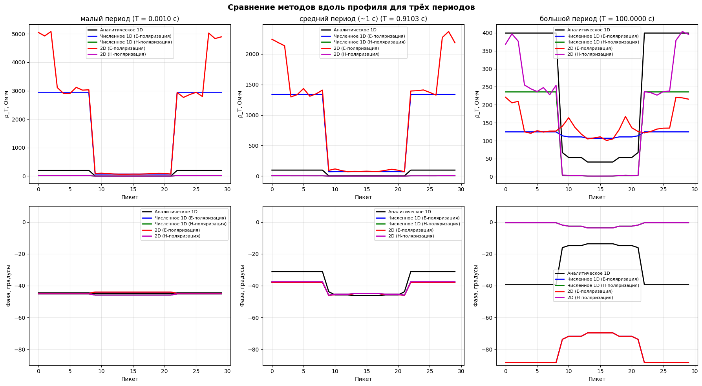

# Моделирование магнитотеллурических зондирований

Сравнение аналитического и численного решения прямой задачи магнитотеллурического зондирования (МТЗ) для 2D модели грабена.

## О проекте

В проекте реализованы три подхода к решению прямой задачи МТЗ:

- **Аналитическое 1D решение** — рекуррентный метод для горизонтально-слоистой среды.
- **Численное 1D решение** — конечно-разностная схема на неравномерной сетке.
- **2D решение через SimPEG** — с fallback-эмуляцией, если библиотека недоступна.

Методы сравниваются на синтетической модели грабена с проводящим заполнением.

## Что сделано

- Реализован расчёт импеданса Zxy (E-поляризация) и Zyx (H-поляризация) для всех трёх методов.
- Построены пространственно-временные карты кажущегося сопротивления ρ_T и фазы импеданса φ.
- Сравнение методов вдоль профиля для трёх характерных периодов.
- Рассчитаны таблицы относительных невязок между 1D и 2D решениями.

## Результаты

### Геоэлектрическая модель

Модель грабена с проводящим заполнением (удельное сопротивление в Ом·м).



### Пространственно-временные карты кажущегося сопротивления

Сравнение трёх методов: аналитическое 1D, численное 1D, 2D (SimPEG).

**E-поляризация (Zxy):**



**H-поляризация (Zyx):**



### Пространственно-временные карты фазы импеданса

**E-поляризация (Zxy):**



**H-поляризация (Zyx):**



### Профильные графики для трёх периодов

Сравнение всех методов вдоль профиля для малого, среднего (~1 с) и большого периодов.




## Структура репозитория

```
magnetotelluric-modeling/
    notebooks/
      01_mt_forward_modeling.ipynb # Основной ноутбук со сценарием
    src/
      __init__.py
      constants.py # Физические константы
      analytical.py # Аналитическое 1D решение
      numerical.py # Численное 1D решение
      models.py # Генерация модели грабена
      visualization.py # Функции визуализации
      simpeg_2d.py # 2D расчёт через SimPEG
    requirements.txt
    .gitignore
    README.md
```

## Как запустить

Проект рассчитан на запуск в Google Colab — устанавливать Python и библиотеки локально не нужно.

### Способ 1. Быстрый (прямо из GitHub)

1. Откройте [Google Colab](https://colab.research.google.com/) и войдите в Google-аккаунт.
2. В меню выберите **«Файл» → «Открыть ноутбук» → вкладка «GitHub»**.
3. В поле «Введите URL» вставьте ссылку на репозиторий:
   `https://github.com/sergeykobanov26-hub/magnetotelluric-modeling`
4. Colab покажет список файлов — выберите `notebooks/01_mt_forward_modeling.ipynb`.
5. В меню выберите **«Среда выполнения» → «Выполнить всё»** (Runtime → Run all).
6. Через 1–3 минуты появятся графики и таблицы сравнения методов.

### Способ 2. Через клонирование репозитория

В первой ячейке Colab выполните:

```python
!git clone https://github.com/sergeykobanov26-hub/magnetotelluric-modeling.git
%cd magnetotelluric-modeling
!pip install -r requirements.txt
```

## Стек

- **Python 3**
- **NumPy** — численные расчёты
- **Matplotlib** — визуализация
- **SciPy** — научные вычисления
- **SimPEG / discretize** — 2D электромагнитное моделирование

## Автор

Сергей Кобанов 
